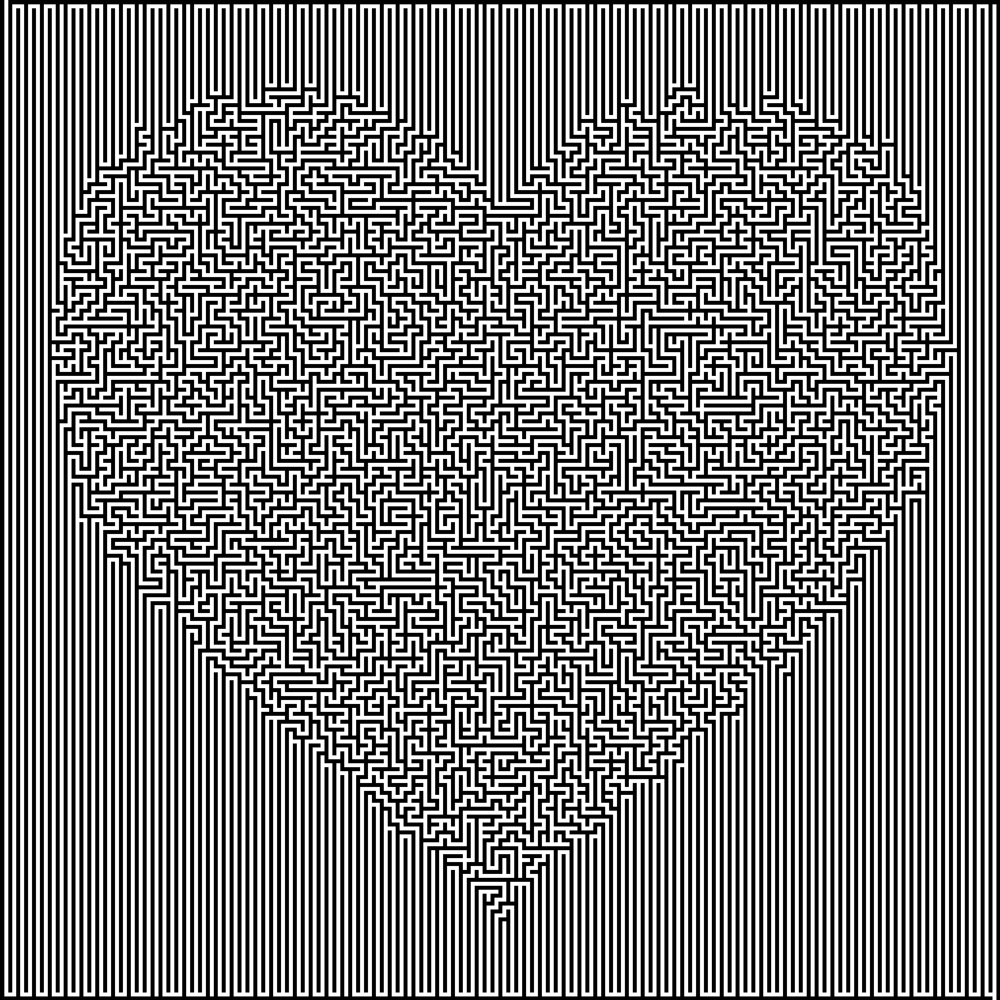

# Biased-Maze-Generator

## This is an old project, the quality of code doesn't represent my code quality today. This will be re written in the near future to make it more readable/optimise it.

A program that generates a maze (as an image) using an Image as a bias input.
All the Mazes are actually solvable. All mazes start from the top left and finish bottom right, but any 2 random points on the maze can be start and finish.
  

Example (Heart and Heart_maze):

  

    
  

  

    
  

  
